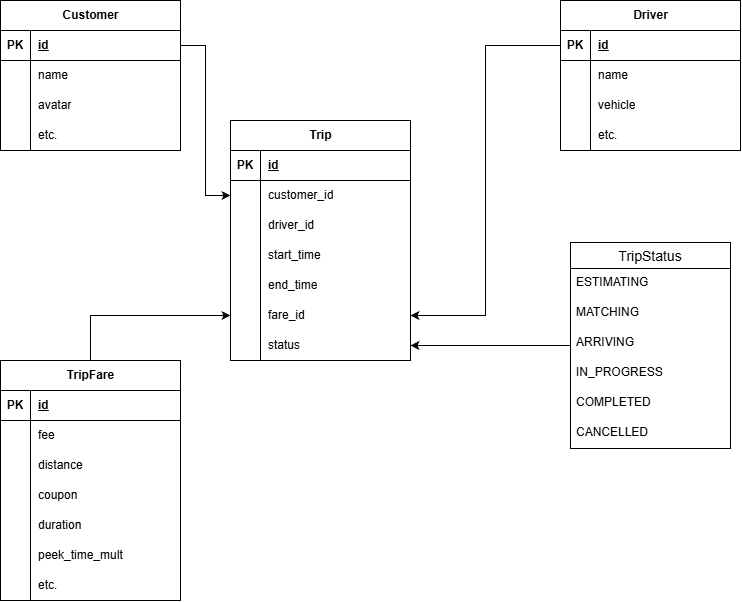
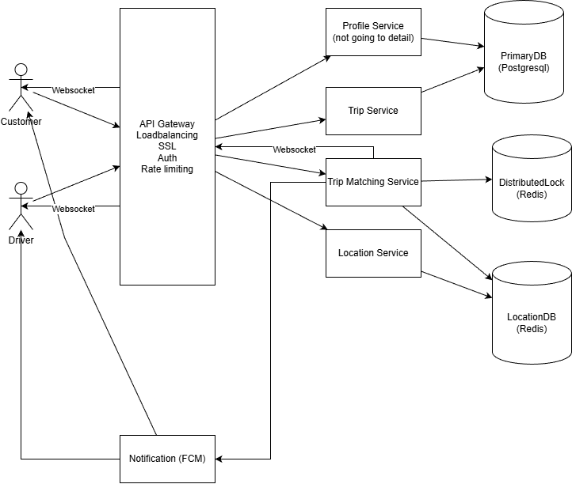

# Requirement
Design a core ride-hailing system (eg: Uber, Grab) focusing on the end-to-end lifecycle
of a ride request and driver matching.

# Use case
- **Customer** request to estimate a ride: Customer enter start location and destination location, system estimates the trip price and waditing time for a driver.
- **Customer** request a ride: Customer confirm source location and destination location and system will find drivers that near customer.
- Ride matching base on location ranking and push notification to close drivers.
- **Driver** confirm request from customer: Make a trip connect between customer and driver.
- **Driver** cancel a ride: Make the driver available again and find another driver for booking user.
- **Driver** finish the trip: After arriving the destination, driver is released to accept another ride request.

## Out of scope
- **Customer/driver** registers for an account.
- **Customer/driver** logins, edits his/her profiles.
- **Driver** update status to be ready for accepting ride request
- Calculate drive free (based on weather, surge request, peak time, etc), using coupon.
- Analyze data from trips such as caculate how many trip a day, total revenue, etc
- Review drivers/customers
- Ranking trip base on additional information such as rating, vehicle type, etc.
- Handle spam request/cancel a ride from customer, cancel a ride from drivers
- Share trip status
- Update destination while on the trip

# Non-functional requirement
- High availability
- Scale globally -> scale to multiple regions globally
- Efficient rider-driver matching

## Out of scope
- Fail over design
- CI/CD
- Log, monitor, alerting

# Rough estimation
Assumptions:
- 10 million daily active riders => 
- 1 million daily active drivers
- Ride requests: assume that 1.5 trip/1 rider/1 day => 15 million trip/day
- Location updates: drivers update location every 10 seconds (we can optimize this more and I will discuss about it in detail design)
Estimate:
- Trip request QPS: 15M/86400 = 173 request/s. Assume that 80% trips come from peak time, QPS = 173 * 4 = 692 request/s
- Location update: Daily active user = 1M => concurent user ~ 700k => QPS = 700k/10 = 70k writes/s
- Storage for a year:
  - Trip history: 15M * 365 * 2KB ~ 11TB
  - Customers and driver profile: Assume total customer = 10 * DAU and total driver = 3 * DAU, each user profile cost 500 bytes, so total storage = (10 * 10M + 3 * 1M) * 500 = 51GB (this doesn't count for media data such as avatar, only raw data)

# API
### Customer: Get trip estimation
`POST /v1/trip/estimate`
* **Request:** 
```
{ 
    customer_id, // long
    source_lat, // double
    source_lng, // double
    dest_lat, // double
    dest_lng // double
}
```
* **Response:** `200 OK`
```
{ 
    trip_id, // long
    status: "ESTIMATING"
}
```
With trip_id, we can reuse it later for update trip status
### Customer: Request trip
`POST /v1/trip/request`
* **Request:** 
```
{ 
    trip_id, // long
}
```
* **Response:** `200 OK`
```
{ 
    trip_id, // long
    status: "MATCHING"
}
```
With trip_id, we can reuse it later for update trip status

### Driver: accept/reject an offer trip
`POST /v1/trip/driver/response`
* **Request:** 
```
{ 
    trip_id, // long
    accept // true/false
}
```
* **Response:** `200 OK`

### Driver: Update trip status
`POST /trip/driver/update

### Driver: Update current location
`POST /v1/driver/location`
* **Request:** 
```
{ 
    driver_id, // long
    lat, // double
    lng, // double
    direction, // float
    speed // double with km/h
}
```
* **Response:** `204 No Content`

### Driver: Update trip when pickup/dropoff
`POST /v1/driver/update`
* **Request:** 
```
{ 
    trip_id,
    status // PICKUP/DROPOFF
}
```
* **Response:** `204 No Content`

### Tracking driver after driver accepts trip request
Since this is realtime event that push information from server so it's better suitable with websocket mechanism. I will discuss this further in detailed design
For customer, send request:
```
{
  trip_id
}
```
When the vehicle move, server push message to customer device
```
{
    trip_id,
    lat,
    lng,
    direction,
    speed
}
```

# Design database
Main database:

For driver location database, I only use Redis since it's realtime data, doesn't need to persist to database and requires high read/write frequently
Since Redis support GEOHASH to query data with location coordinate, I'm going to use GEOHASH to store and query driver ids based on trip request location

# Detailed design

## Deployment model

- Profile Service: store and return customer/driver profile as they are requested.
- Trip Service: create/get/update trip information
- Location Service: update location driver as they move around
- Trip Matching Service: handle trip request, find and match between trip and driver
## Location update
- To update location, driver device send `POST /v1/driver/location` with interval 10 seconds
- Update redis: `GEOADD drivers:available lng lat driver_id` or `GEOADD drivers:busy lng lat driver_id` depending on if driver is on a trip
- For some situation like driver doesn't move (traffic jam, rest, etc), driver may not send update location as it doesn't change

## Trip matching
- After customer request a trip, `Trip Matching Service` query to location database to get top k available drivers candidates
- `Trip Matching Service` send request to candidates with condition:
    - To avoid a driver receive more than trip request at a time, we can use a lock machanism with distributed lock. Everytime a request is push to a driver, system lock driver with an timeout (for example: 20s and at that moment, there's no other trip request for driver)
    - Also implement distributed lock for `trip_id` to avoid more than 1 driver can accept the trip. Another solution is keep handling `trip_id` in specific instance so we don't have to worry about this concurrent issue anymore.
This trip matching can be summary in this sequence events:
1. Customer send `POST /v1/trip/estimate`
2. `Trip Service` create a new `Trip` record with state `ESTIMATING` and response estimated price
3. Customer send `POST /v1/trip/request`
4. `Trip Service` updates the trip status to `MATCHING`. `Matching Service` query k candidate drivers from Redis database with GEOHASH query. In case can't find driver candidate, system can retry for a timeout then cancel the trip
5. `Notification Service` sends a "New Ride" alert to the Driver via WebSocket.
6. Driver accepts. The `Trip Service` updates the status to `ARRIVING`. Also needs to update driver status in redis to `busy`
7. Update trip when pickup/dropoff using `POST /v1/driver/update`. After finish the trip, driver status change to `available` to receive another trip


# Bottom necks & Mitigation

### High latency and scalability
The interesting feature in rade hailing is its locality feature as only users in the same location can interact with each other. For example, in Hanoi, customer can only find a driver in Hanoi and travel in Hanoi. So to reduce latancy and increase scalability, we can deploy the cluster in multiple location and allow user connects to the nearest server.
For example, we can deploy a cluster in Hanoi to handle ride request for specific user in Hanoi, another one in Seoul to handle ride matching in Seoul.

### Tracking real time
Due to latancy, the driver position may not be accurate as push data. Customer device can use information such as last position, vehicle direction and speed to simulate current location